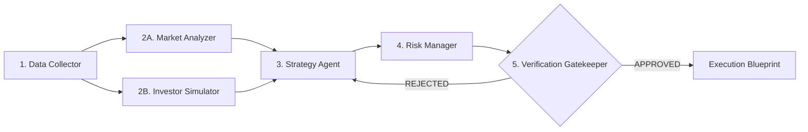

# AGENTS.md - Multi-Agent Stock Investment & Market Simulation System

Tài liệu hướng dẫn kiến trúc, quy định vận hành và chuẩn mực phát triển cho các AI Agents (Gemini, Claude, Antigravity) và Developers làm việc trên repository này.

---

## 📌 1. Tổng quan Dự án (Project Overview)

Repository này chứa hệ thống **Multi-Agent Đầu tư Chứng khoán chuyên nghiệp** tích hợp quy trình 5 bước nghiêm ngặt và **Engine Giả lập Tâm lý & Hành vi 10 Nhà đầu tư Mô phỏng Người thật** (có khả năng mở rộng lên 10.000 Agents).

### Mục tiêu chính:
1. Loại bỏ yếu tố cảm xúc cá nhân trong đầu tư thông qua quy trình 5 bước khép kín.
2. Đo lường bức tranh tâm lý đám đông và dòng tiền thị trường (Market Psychology & Order Flow) tại từng mốc thời gian.
3. Đảm bảo tính kỷ luật và bảo vệ vốn thông qua **Hội đồng Xác thực (Investment Committee Verification Gatekeeper)** trước khi giải ngân.

---

## 🏗️ 2. Cấu trúc Thư mục (Directory Layout)

```
/Users/aminhp93/personal/stock/
├── AGENTS.md                 # Master instructions & rulebook cho AI agents
├── requirements.txt          # Thư viện phụ thuộc (Pydantic v2, Pandas, DuckDB, NumPy, Tabulate)
├── main.py                   # Entry point chạy thử nghiệm hệ thống
├── config/
│   ├── settings.py           # Cấu hình hệ thống & Tham số rủi ro mặc định
│   └── personas.json         # Định nghĩa 10 Persona nhà đầu tư mô phỏng người thật
├── src/
│   ├── models/               # Pydantic Schemas
│   │   ├── market_data.py    # PriceBar, FinancialMetrics, MacroNews, MarketContext
│   │   ├── persona.py        # PersonaProfile, PersonaDecision, SimulationConsensus
│   │   └── strategy.py       # TradingPlan, RiskAssessment, VerificationVerdict
│   ├── agents/               # 5 Step Agents & Simulation Engine
│   │   ├── base_agent.py     # Base Class Abstract `BaseAgent`
│   │   ├── data_agent.py     # Step 1: DataCollectionAgent (Point-In-Time)
│   │   ├── market_agent.py   # Step 2A: MarketAnalyzerAgent (Tech & Fundamental)
│   │   ├── simulator.py      # Step 2B: BehavioralSimulationEngine (10 Personas & 10,000 Matrix)
│   │   ├── strategy_agent.py # Step 3: StrategyAgent (Bull/Base/Bear scenarios)
│   │   ├── risk_agent.py     # Step 4: RiskManagerAgent (Kelly Position Sizing & Drawdown)
│   │   └── verify_agent.py   # Step 5: InvestmentVerifierAgent (Gatekeeper 7 Standards)
│   ├── workflow/             # Workflow & Backtest Engines
│   │   ├── engine.py         # InvestmentWorkflowEngine (Pipeline Orchestrator)
│   │   └── backtester.py     # TimeStepBacktester (Historical Time-Series Testing)
│   └── utils/
│       ├── metrics.py        # RSI, MACD, Kelly Criterion, RRR, Margin of Safety
│       └── formatters.py     # Format báo cáo ASCII/Markdown đẹp mắt
```

---

## 🔄 3. Quy trình Vận hành 5 Bước (5-Step Workflow Architecture)



### Chi tiết các Agent:

1. **`DataCollectorAgent` ([`data_agent.py`](file:///Users/aminhp93/personal/stock/src/agents/data_agent.py))**:
   - Thu thập giá OHLCV, chỉ số tài chính (DCF, PE, PB, ROE) và tin tức vĩ mô tại mốc thời gian $T$.
   - **Quy tắc**: Tuyệt đối bảo đảm dữ liệu Point-In-Time, không để rò rỉ dữ liệu tương lai $T+1$ (Lookahead Bias).

2. **`MarketAnalyzerAgent` ([`market_agent.py`](file:///Users/aminhp93/personal/stock/src/agents/market_agent.py))**:
   - Phân tích kỹ thuật (RSI, MA20/50 trend) và định giá cơ bản (Margin of Safety).

3. **`BehavioralSimulationEngine` ([`simulator.py`](file:///Users/aminhp93/personal/stock/src/agents/simulator.py))**:
   - Giả lập 10 Persona nhà đầu tư (F0 FOMO, Deep Value, Swing Trader, Panic Seller, Quant Fund, Dividend Growth, Contrarian, T+ Scalper, Smart Money, Macro Strategist).
   - Xuất báo cáo Đồng thuận Thị trường (Buy %, Sell %, Hold %, Panic %, Sentiment Index).
   - Cung cấp phương thức `run_large_scale_simulation(count=10000)` mô phỏng ma trận Monte-Carlo cho quy mô lớn.

4. **`StrategyAgent` ([`strategy_agent.py`](file:///Users/aminhp93/personal/stock/src/agents/strategy_agent.py))**:
   - Thiết lập 3 kịch bản (Bull 35%, Base 50%, Bear 15%), điểm Entry Zone, Stop Loss và Take Profit.

5. **`RiskManagerAgent` ([`risk_agent.py`](file:///Users/aminhp93/personal/stock/src/agents/risk_agent.py))**:
   - Tính toán quy mô vị thế Kelly Criterion, đảm bảo Risk/Reward Ratio $\ge 1:2.5$ và vị thế $\le 20\%$ tài khoản.

6. **`InvestmentVerifierAgent` ([`verify_agent.py`](file:///Users/aminhp93/personal/stock/src/agents/verify_agent.py))**:
   - Hội đồng Kiểm định 7 tiêu chí độc lập. Quyết định `APPROVED` nếu đạt $\ge 5/6$ tiêu chí và tuân thủ tuyệt đối quy định rủi ro.

---

## 🎯 4. Quy tắc Mở rộng & Quy định cho Developers / AI Agents

Khi tham gia phát triển hoặc sửa đổi dự án này, AI Agents và Developers **BẮT BUỘC** tuân thủ các quy tắc sau:

> [!IMPORTANT]
> 1. **Bảo tồn Schema Pydantic**: Mọi thay đổi về dữ liệu đầu vào/đầu ra giữa các agent phải thông qua các model Pydantic trong `src/models/`. Không truyền `dict` tự do giữa các agent.
> 2. **Không nới lỏng Tiêu chuẩn Rủi ro**: Tuyệt đối không hạ thấp các tiêu chuẩn rủi ro trong `config/settings.py` (Max allocation $\le 20\%$, Min RRR $\ge 2.5$) để gượng ép duyệt lệnh.
> 3. **Mở rộng Persona trong `personas.json`**: Khi bổ sung nhân vật nhà đầu tư mới, hãy định nghĩa đầy đủ các trường `risk_tolerance`, `news_sensitivity`, `technical_weight`, `fundamental_weight`, `herd_instinct`, và `panic_threshold`.
> 4. **Kiểm thử bắt buộc**: Sau mỗi chỉnh sửa code, phải chạy `python3 main.py` để đảm bảo pipeline 5 bước và engine giả lập không bị vỡ.

---

## 💻 5. Lệnh Khởi Chạy & Kiểm Thử (Commands)

```bash
# Cài đặt môi trường
pip install -r requirements.txt

# Chạy thử nghiệm toàn bộ quy trình & giả lập
python3 main.py
```
