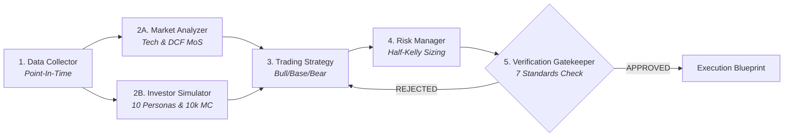

# AGENTS.md - Multi-Agent Stock Investment & Market Simulation System

Tài liệu hướng dẫn kiến trúc, quy định vận hành và chuẩn mực phát triển toàn diện cho các AI Agents (Gemini, Claude, Antigravity) và Developers làm việc trên repository này.

---

## 📌 1. Tổng Quan Dự Án (Project Overview)

Repository này chứa hệ thống **Multi-Agent Đầu tư Chứng khoán Chuyên nghiệp** kết hợp quy trình 5 bước nghiêm ngặt, **Engine Giả lập Tâm lý & Hành vi 10 Nhà đầu tư Mô phỏng Người thật (mở rộng 10.000 Agents Monte-Carlo)**, và **Hội đồng Xác thực Gatekeeper 7 Tiêu chuẩn**, đi kèm giao diện Web SPA hiện đại viết bằng **Vite + React (TypeScript)** theo phong cách **Minimalist Light Theme**.

### Mục tiêu cốt lõi:
1. **Loại bỏ yếu tố cảm xúc & thiên kiến cá nhân** trong đầu tư thông qua quy trình 5 bước khép kín Point-In-Time.
2. **Đo lường bức tranh tâm lý đám đông & dòng tiền thị trường** (Order Flow & Behavioral Psychology) tại từng mốc thời gian $T$.
3. **Bảo vệ an toàn vốn & kỷ luật danh mục** thông qua **Hội đồng Kiểm định Gatekeeper 7 Tiêu chuẩn** và định cỡ vị thế **Half-Kelly Criterion**.
4. **Trực quan hóa thời gian thực** với đồ thị TradingView Lightweight Charts và bảng điều khiển mô phỏng tương tác.

---

## 🏗️ 2. Cấu Trúc Thư Mục Toàn Diện (Directory Layout)

```
/Users/aminhp93/personal/githubcoffee/stock/
├── AGENTS.md                 # Master Rulebook & Kiến trúc hệ thống
├── CLAUDE.md                 # Quick reference cho AI assistants
├── requirements.txt          # Thư viện Python (Pydantic v2, Pandas, DuckDB, NumPy, Tabulate, psycopg2)
├── package.json              # Frontend Node dependencies (React 18, React Router v6, Lightweight Charts, Lucide)
├── vite.config.ts            # Cấu hình Vite & Proxy API sang Python Backend :8000
├── tsconfig.json             # Cấu hình TypeScript
├── index.html                # Single Page Application HTML Root
├── main.py                   # Entry point chạy test kiểm định 5 bước & Backtester
├── server.py                 # Backend API Server & SPA Static File Server (:8000)
├── config/
│   ├── settings.py           # Tham số rủi ro hệ thống & cấu hình mặc định
│   └── personas.json         # Định nghĩa 10 Persona nhà đầu tư mô phỏng người thật
├── prompts/                  # Lịch sử ghi nhận các phiên làm việc & prompts phát triển
│   ├── README.md             # Hướng dẫn lưu trữ prompt history
│   └── 01_vite_rewrite.md    # Nhật ký phiên viết lại ứng dụng bằng Vite 3 trang
├── scripts/
│   ├── fetch_vn_stocks_2025.py
│   ├── fetch_vn_stocks_2026.py
│   └── fetch_vn_stocks_history.py
└── src/
    ├── main.tsx              # React Entry Point
    ├── App.tsx               # Client Routing (/data, /chart, /dashboard)
    ├── index.css             # Minimalist Light Design System & CSS Variables
    ├── types/                # TypeScript Interfaces tương ứng Pydantic Schemas
    │   └── index.ts
    ├── services/             # API Client giao tiếp Backend Python
    │   └── api.ts
    ├── components/           # Reusable UI Components
    │   ├── Navbar.tsx        # Top Sticky Header Navigation
    │   ├── PipelineFlow.tsx  # Sơ đồ tương tác 5 bước Multi-Agent
    │   ├── Calculator.tsx    # Mô phỏng đầu tư 500Tr (Lump Sum vs DCA vs Tiết Kiệm)
    │   ├── StockChart.tsx    # TradingView Candlesticks + Volume + MA20/50 + RSI(14)
    │   ├── PersonaGrid.tsx   # Danh sách 10 Personas nhà đầu tư & Quyết định
    │   ├── MonteCarloSim.tsx # Bộ kích hoạt Monte-Carlo 10.000 Agents on-demand
    │   ├── VerifierChecklist.tsx # Bảng kiểm định 7 tiêu chuẩn Gatekeeper
    │   └── TelegramModal.tsx # Modal phân tích tâm lý đám đông Telegram
    ├── pages/                # 3 Phân Hệ Chính
    │   ├── DataPage.tsx      # 1. Dữ liệu (/data) - Tra cứu, Đồng bộ & Cập nhật raw data
    │   ├── ChartPage.tsx     # 2. Biểu đồ (/chart) - TradingView Visualizer
    │   └── DashboardPage.tsx # 3. Giả lập (/dashboard) - Simulation Control Room
    ├── agents/               # 5 Step Agents & Simulation Engine (Python)
    │   ├── base_agent.py     # Base Class Abstract `BaseAgent`
    │   ├── data_agent.py     # Step 1: DataCollectionAgent (Point-In-Time)
    │   ├── market_agent.py   # Step 2A: MarketAnalyzerAgent (Tech & Fundamental)
    │   ├── simulator.py      # Step 2B: BehavioralSimulationEngine (10 Personas & 10k Monte-Carlo)
    │   ├── strategy_agent.py # Step 3: StrategyAgent (Bull/Base/Bear Scenarios)
    │   ├── risk_agent.py     # Step 4: RiskManagerAgent (Kelly Position Sizing)
    │   └── verify_agent.py   # Step 5: InvestmentVerifierAgent (Gatekeeper 7 Standards)
    ├── db/                   # Database Managers
    │   └── postgres.py       # PostgreSQL Stock DB Connector (464k nến, 1,403 mã)
    ├── models/               # Pydantic v2 Schemas
    │   ├── market_data.py    # PriceBar, FinancialMetrics, MacroNews, MarketContext
    │   ├── persona.py        # PersonaProfile, PersonaDecision, SimulationConsensus
    │   └── strategy.py       # TradingPlan, RiskAssessment, VerificationVerdict
    └── utils/
        ├── metrics.py        # RSI, MACD, Kelly Criterion, RRR, Margin of Safety
        └── telegram_analyzer.py # Phân tích tâm lý đám đông Telegram
```

---

## 🔄 3. Quy Trình Vận Hành 5 Bước (5-Step Workflow Architecture)



---

## 🌐 4. Các Tuyến Route Ứng Dụng Web (Vite + React SPA)

Ứng dụng chia thành **3 phân hệ rõ ràng**:

1. **📁 `/data` - [1. Dữ Liệu Thị Trường (View, Sync & Update Raw Data)](file:///Users/aminhp93/personal/githubcoffee/stock/src/pages/DataPage.tsx)**:
   - **Thống kê kho PostgreSQL**: 1,403 mã cổ phiếu, 464,975 nến giá, khung thời gian 2021 – 2026.
   - **Thao tác Đồng Bộ**: Nút *Đồng Bộ Dữ Liệu Ngay* kích hoạt nạp nến mới và xóa cache Point-In-Time.
   - **Danh Mục Mã Cổ Phiếu**: Tra cứu nhanh, lọc theo sàn (HOSE, HNX, UPCoM) và ngành nghề.
   - **Bảng Nến Giá Thô (Raw Data)**: Xem bảng 100 nến giá gần nhất (Open, High, Low, Close, Volume, RSI 14, MA20, MA50) kèm tính năng Export JSON.

2. **📈 `/chart` - [2. Biểu Đồ (TradingView Visualizer)](file:///Users/aminhp93/personal/githubcoffee/stock/src/pages/ChartPage.tsx)**:
   - Đồ thị nến TradingView Lightweight Charts v4, Volume bars, MA20/MA50, RSI(14) sub-chart.
   - Bộ chọn mã cổ phiếu nhanh & lọc khung thời gian (1M, 3M, 6M, 1Y, ALL).
   - Sidebar HUD hiển thị quyết định phê duyệt Gatekeeper, Vị thế Kelly, MoS %, và Telegram Hype.

3. **🎛️ `/dashboard` - [3. Giả Lập (Simulation Control Room)](file:///Users/aminhp93/personal/githubcoffee/stock/src/pages/DashboardPage.tsx)**:
   - Thẻ chỉ số tài chính cơ bản & định giá DCF.
   - Ma trận quyết định của 10 Personas người thật với độ tin cậy và lý giải chi tiết.
   - Bộ kích hoạt Monte-Carlo 10.000 Agents on-demand.
   - 3 Kịch bản Bull/Base/Bear, Quản trị rủi ro Half-Kelly, và Checklist 7 tiêu chuẩn Gatekeeper.

4. **💰 `/finance` - [4. Tài Chính Cá Nhân & Kế Hoạch Đầu Tư (Personal Finance Hub)](file:///Users/aminhp93/personal/githubcoffee/stock/src/pages/FinancePage.tsx)**:
   - **Mô phỏng Lãi Kép 500 Triệu**: So sánh trực quan giữa Tiết Kiệm Ngân Hàng, Đầu Tư Một Lần (Lump Sum) và Tích Sản Định Kỳ (DCA).
   - **Mục Tiêu Tự Do Tài Chính (FIRE Planner)**: Quy tắc 4% tính toán cột mốc tài sản tự do tài chính dựa trên chi tiêu tháng.
   - **Quỹ An Toàn & Phân Bổ Danh Mục**: Tính toán quỹ khẩn cấp 6 tháng và tỷ trọng phân bổ (Cổ phiếu, ETF, Tiền mặt, Vàng) theo hồ sơ rủi ro.

---

## 🔌 5. Danh Sách Backend API Endpoints (`server.py`)

| Endpoint | Method | Tham số | Mô tả |
|---|---|---|---|
| `/api/data/stats` | GET | Không | Thống kê số lượng mã, số nến giá, khung thời gian và trạng thái DB |
| `/api/data/raw-prices` | GET | `symbol`, `limit` | Bảng nến giá thô OHLCV, Volume, RSI 14, MA20, MA50 |
| `/api/data/sync` | POST / GET | `symbol` | Đồng bộ, xóa cache và cập nhật nến mới nhất |
| `/api/stocks` | GET | Không | Danh sách mã cổ phiếu (HOSE, HNX, UPCoM) |
| `/api/chart` | GET | `symbol`, `start_date` | Dữ liệu nến giá OHLCV, Volume, MA20, MA50, RSI cho TradingView |
| `/api/summary` | GET | `symbol` | Kết quả toàn diện pipeline 5 bước, 10 Personas, 7 checklist, DCF MoS |
| `/api/simulation` | GET | `symbol`, `count` | Kích hoạt chạy Monte-Carlo $N$ agents (mặc định 10.000) |
| `/api/telegram-sentiment` | GET | `symbol` (tùy chọn) | Phân tích cảm xúc cộng đồng Telegram, tỷ lệ hưng phấn (Euphoria %) |

---

## 💻 6. Lệnh Khởi Chạy Hệ Thống (Commands)

```bash
# 1. Cài đặt môi trường Python & Node
pip install -r requirements.txt
pnpm install

# 2. Chạy Backend API Server (Port 8000)
python3 server.py

# 3. Chạy Frontend Vite Dev Server (Port 5173)
pnpm run dev

# 4. Chạy kiểm thử tự động toàn bộ Pipeline & Backtester
python3 main.py
```
